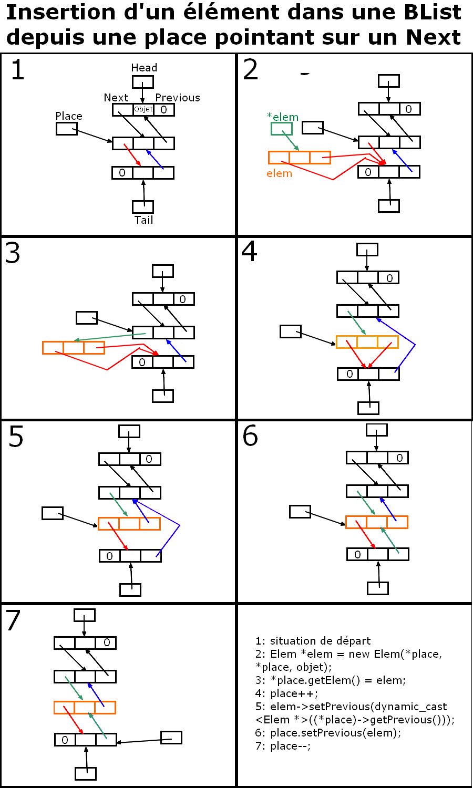
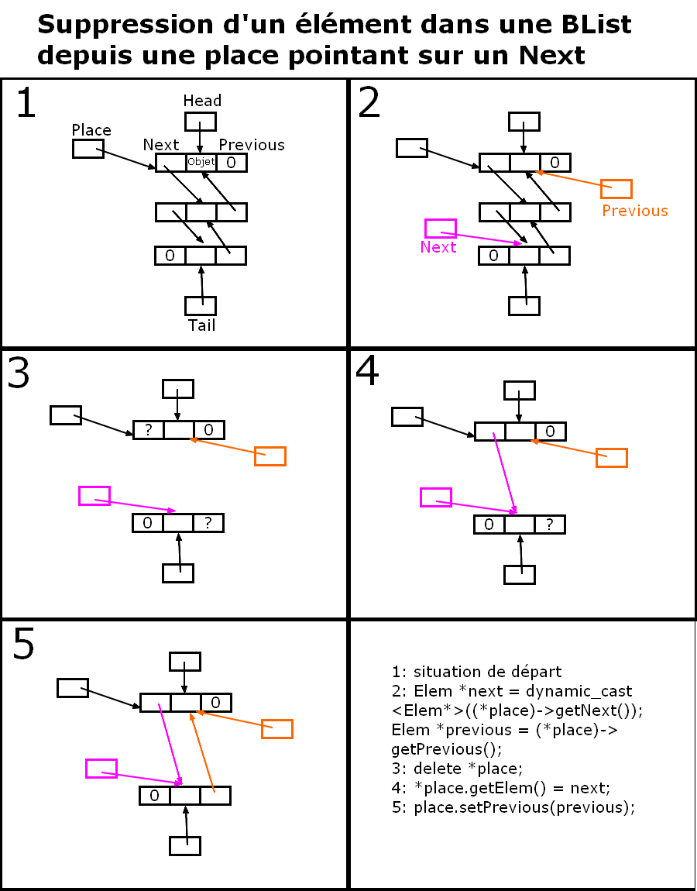

# list-from-scratch-cpp

## Quickstart

```
g++ -o main.o src/main.cpp  src/Test.cpp
./main.o
```

## Introduction

The goal of this programming exercise is to demonstrate a good knowledge and proper use of the syntactic constructs of the C++ programming language and the inheritance hierarchies. The evaluation will therefore focus on writing, coding, presentation, constructs, and the relevance of the choices made in this context.

## Problem statement

The problem is to realize a list definition in a "C++ style". The objective will be to determine a good template parameterization, a good nested class, a good class hierarchy, and good use of accessibility and redefinitions.

We, therefore, assume that we have an abstract class of "Cont", a general structure containing objects of a certain type. The following primitives are defined: size (number of elements contained), empty (boolean value), and clear (which empties the structure). This class also defines a "Place" type, a pseudo-pointer to access an element via a redefined "*" (dereferencing) operator. A particular value " Λ " of this place corresponds to an invalid reference, i.e. not dereferenceable. An exception handling must be provided.

A special case is the "List" class which, as its name indicates, realizes a simple list. This class has as primitives add (add an element to the given place) and sup (remove the element from the given place). This class also introduces the operator "++" on the places (for the path) and the primitive first corresponding to the place of the first element of the list. The value of ++ in the last place is Λ; this is not an error. On the other hand, we cannot apply this operator on a value Λ.

Finally, a bi-directional list class "BList". This one is a simple enrichment with a "--" operator and the last access primitive in place of the last element of the list to allow a backward traversal. A BList class is a descendant of the List class; it must therefore be able to be handled correctly in a generic way as such.
A program must be able to define objects of type "Place", "List", "Place of List", "BList”, and "Place of BList".

## Implementation

To be efficient, the choice of the physical implementation of the list - hidden by the interface and inaccessible, except perhaps partially to the descendants - will be to create an "Elem" class containing the object and a "next" pointer to the next Elem object. The objects of type List will thus contain an attribute " head ", pointer towards the first Elem object.

On the other hand, in order not to have to deal with special cases for insertion or deletion at the head of the list, the places will be pointers to these pointers to elements: the first place is (physically) a pointer to head, the following places are a pointer to the next attribute of the previous element. The * operator must of course hide this implementation choice.

For the BList class, you will choose a similar implementation, with the "tail" attribute in the class and the "prev" attribute in the elements. It should be efficient and consistent with the problem at hand. This is the main difficulty of this project.

## Realization

You are asked to realize in C++ the hierarchies of class models described above.

To test your model, you will instantiate a simple list of integers and a (different) bidirectional list. Then, you will write a function that inverts a list ("the first will be last"), which you will test on your two examples.

The executed program will have to show its robustness to special cases: empty list, one element list, etc. It will also show the correct operation of the primitives, including in the various situations (insertion or deletion at the beginning, at the end, in the middle, etc.). The correct choice of tests is a criterion for evaluating the work. The Cont primitives will also be tested, in particular, the action on a list after the call to clear on the lists seen as of type Cont.
As a good C++ programmer, you will provide clean exception handling.

In general, conciseness, precision, readability (clarity of the source), efficiency (no unnecessary or inappropriate operations), and the right choice of structures will be essential criteria for evaluating the work. Brief comments in the source code are desired to clarify the coding choices.

## BList behavior diagrams

### Add element


### Delete element

